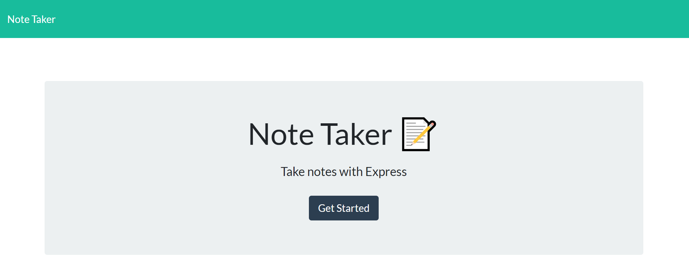
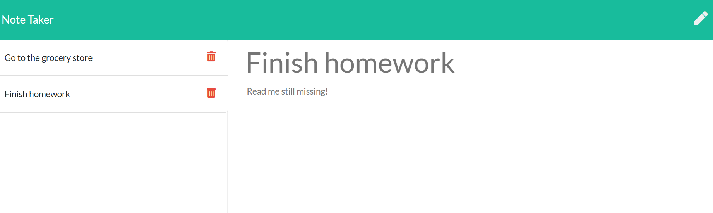

# take-a-note

## Description

Application to write, save, and delete notes. This app uses Express backend to save and retrieve note data to and from a JSON file.

## Table of Contents

* [deployedSite](#Deployed Site)
* [Usage](#Usage)

## Deployed Site
[herokusite](https://cryptic-anchorage-46064.herokuapp.com/)

## Usage
Keep track of your thoughts and tasks!
Write and save notes, delete notes once you've completed your tasks.

